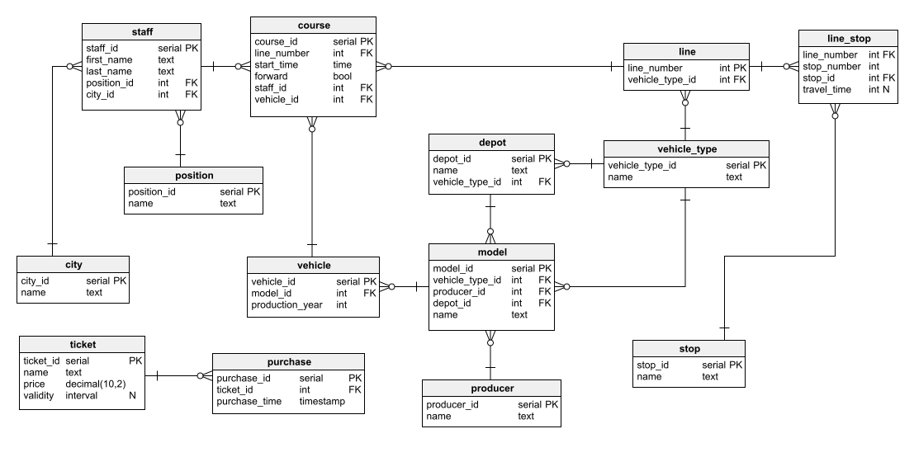

# Public transport system -  Database project

## Overwiev

The goal of the project was to implement a PostgreSQL database for a fictional city's public transport system. The database has been filled with made up data related to staff, vehicles, stops, lines etc. The physical model of the database can be seen below.

The next figure depicts the city's stops network.

## Additional implementations

The data structures have been properly designed and created using constraints like keys, checks and defaults.
Moreover, the database has been expanded to include:
- ### Functions
  - stop_schedule - returns information about all courses that go through the given stop
  - connection - returns information about all courses that can take the passenger from one given stop to another
  - update_course - updates the given column of the table $course$ with the given value
  - ticket_validity - checks if the given time ticket is valid or not
- ### Triggers
  - only_drivers_drive - ensures that all the staff members assigned to courses are indeed drivers
  - valid_line_number - ensures that all the line numbers follow the fixed pattern
  ### Views
  - all_data - presents all the operational data related to courses in one, denormalized form

  ## What's next?
  The current plan is to create a mobile app for finding connections between any stops in the city's area (it's actually on its way :D)

  ## Repository's content description
  The following files have been uploaded:
  
  - ### public_transport_script.sql
    The script with the database's implementation
  - ### database_model.png
    The image of the database's model
  - ### stops_network.png
    The visualization of the city's stops network